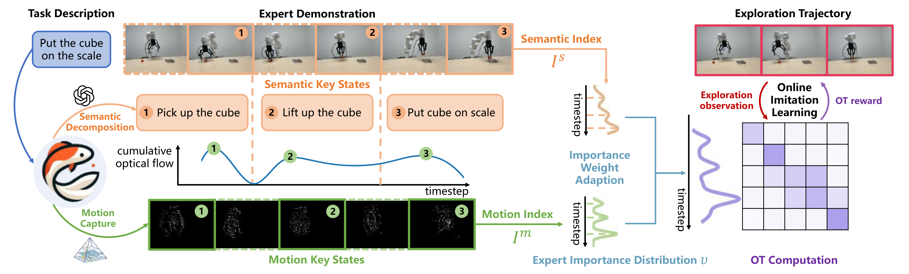

# KOI: Accelerating Online Imitation Learning via Hybrid Key-state Guidance

Authors: [Jingxian Lu](https://github.com/JingxianLu)\*, [Wenke Xia](https://xwinks.github.io/)\*, [Dong Wang](https://scholar.google.es/citations?user=dasL9V4AAAAJ&hl=zh-CN)‡, [Zhigang Wang](https://scholar.google.com/citations?hl=zh-CN&user=cw3EaAYAAAAJ&view_op=list_works&sortby=pubdate), [Bin Zhao](https://scholar.google.com/citations?user=DQB0hqwAAAAJ&hl=zh-CN), [Di Hu](https://dtaoo.github.io/)‡, [Xuelong Li](https://iopen.nwpu.edu.cn/info/1329/1171.htm)

Accepted By: __2024 Conference on Robot Learning (CoRL)__

Resources:[[Project Page](https://gewu-lab.github.io/Keystate_Online_Imitation/)],[[Arxiv](https://arxiv.org/abs/2408.02912)]

If you have any questions, please open an issue or send an email to jingxianlu1122@gmail.com.
___

## Introduction

This is the PyTorch code of our paper: __KOI: Accelerating Online Imitation Learning via Hybrid Key-state Guidance__.

In this work, we propose the hybrid Key-state guided Online Imitation (KOI) learning method, which estimates precise task-aware reward for efficient online exploration, through decomposing the target task into the objectives of `what to do` and the mechanisms of `how to do`.



As shown, we initially utilize the rich world knowledge of visual-language models to extract semantic key states from expert trajectory, clarifying the objectives of `what to do`. Within intervals between semantic key states, optical flow is employed to identify essential motion key states to comprehend the dynamic transition to the subsequent semantic key state, indicating `how to do` the target task. By integrating both types of key states, we adjust the importance weight of expert trajectory states in OT-based reward estimation to empower efficient online imitation learning.


## Download expert demonstrations, weights [[link]](https://drive.google.com/file/d/1WDkLMIG-Wb-UqoUOvJ8ADMKlLdtYF1jz/view?usp=drive_link)

The link contains all expert demonstrations in our paper.

Please set the `path/to/dir` portion of the `root_dir` path variable in `KOI/cfgs/metaworld_config.yaml` and `KOI/cfgs/libero_config.yaml` to the path of the this repository.

Then, extract the files and place the `expert_demos` and `weights` folders in `${root_dir}/Keystate_Online_Imitation`.


## Setup

This code is tested in Ubuntu 18.04, pytorch 1.12.1+cu113

__Install dependencies__

- Install the requirements

```
pip install -r requirements.txt
```

- If you have problem installing environment libraries [Meta-World](https://github.com/Farama-Foundation/Metaworld/) and [LIBERO](https://github.com/Lifelong-Robot-Learning/LIBERO), please refer to their official documents.

## Train
__Meta-World__ 
  
The models of offline imitation are [provided](https://drive.google.com/file/d/1WDkLMIG-Wb-UqoUOvJ8ADMKlLdtYF1jz/view?usp=drive_link), or can be trained using:

```
python train_metaworld.py agent=bc_metaworld suite/metaworld_task=bin load_bc=false exp_name=bc
```

To run keystate-guided online imitation:

```
python train_metaworld.py agent=koi_metaworld suite/metaworld_task=bin keyidx=[50,160] exp_name=koi
```

The "keyidx" in this command indicates the indexes of semantic key-states of "bin-picking" task. As demonstrated in our paper, they can be extracted by VLMs like this [example](KOI/query_semantic.py), or assigned by users manually.

__LIBERO__

Similarly, to run the offline imitation in LIBERO suite:

```
python train_bc_libero.py agent=bc_libero suite/libero_task=plate num_demos=50 load_bc=false exp_name=bc
```

For online imitation:

```
python train_libero.py agent=koi_libero suite/libero_task=plate keyidx=[40,80] exp_name=koi
```

## Citation 

```
@article{lu2024koi,
  title={KOI: Accelerating Online Imitation Learning via Hybrid Key-state Guidance},
  author={Lu, Jingxian and Xia, Wenke and Wang, Dong and Wang, Zhigang and Zhao, Bin and Hu, Di and Li, Xuelong},
  journal={arXiv preprint arXiv:2408.02912},
  year={2024}
}
```